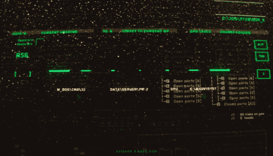

  

 

<table align="center" width="100%" border="0" cellpadding="0" cellspacing="0">
  <tr>
    <td width="20%" align="center" valign="middle">
      
    </td>
    <td width="80%" valign="middle" style="padding-left: 25px;">
      <h1>⚡ SAMY SOLIS</h1>
      <h3>🎛️ FULL STACK DEVELOPER | MOBILE ARCHITECT</h3>
      
<b>Construindo ecossistemas de alta performance com código robusto, tipagem estrita e interfaces de alto nível.</b>

      
      
      
      
    </td>
  </tr>
</table>

---

<table align="center" width="100%">
  <tr>
    <td align="center" width="33%">
       
      <b>FRONTEND & MOBILE</b> 
      <code>TypeScript</code> • <code>React Native</code> 
      <code>JavaScript</code> • <code>Next.js</code>
    </td>
    <td align="center" width="33%">
       
      <b>BACKEND & INFRA</b> 
      <code>Java (Spring)</code> • <code>Node.js</code> 
      <code>SQL / Supabase</code> • <code>Docker</code>
    </td>
    <td align="center" width="33%">
       
      <b>DIRETRIZES</b> 
      <code>Clean Code</code> • <code>SOLID</code> 
      <code>Alta Performance</code> • <code>CI/CD</code>
    </td>
  </tr>
</table>

---

  <table border="0">
    <tr>
      <td>
        
      </td>
      <td>
        
      </td>
    </tr>
  </table>

 

  

---

  
  
  
  

 

  

